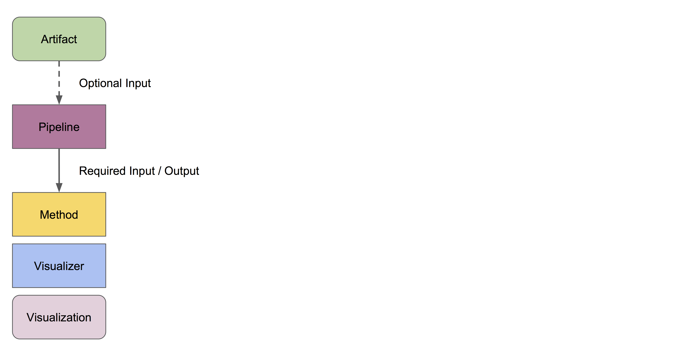
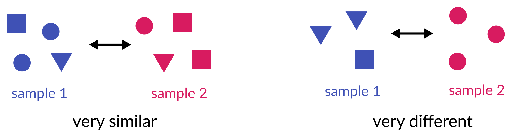
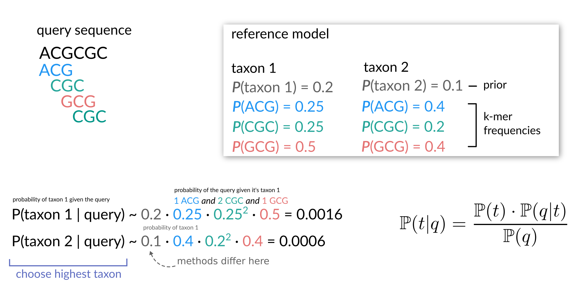

<!-- .slide: data-background="assets/isb/microbes-midnight.jpg" class="dark" -->

# Amplicon Sequencing Data Analysis with QIIME 2

### Christian Diener, Gibbons Lab


from the *2022 ISB Virtual Microbiome Series*

<br>
<div class="footer">
<a href="https://creativecommons.org/licenses/by-sa/4.0/"><i class="fa fa-bullhorn"></i>CC-BY-SA</a>
<a href="https://gibbons.isbscience.org/"><i class="fa fa-globe"></i>gibbons.isbscience.org</a>
<a href="https://github.com/gibbons-lab"><i class="fa fa-github"></i>gibbons-lab</a>
<a href="https://twitter.com/thaasophobia"><i class="fa fa-twitter"></i>@thaasophobia </a>
</div>

---

<!-- .slide: data-background="var(--primary)" class="dark" -->

# Hold your horses :horse:

Let's get the slides first (use your computer, phone, TV, fridge, anything with a 16:9 screen)

*https://gibbons-lab.github.io/isb_course_2022/16S*

---

# Organization of the course

<!-- .slide: data-background="var(--primary)" class="dark" -->


Note:

- this allows asynchronous work / different timezones
- questions on Slack not on Zoom please

---

<!-- .slide: data-background="var(--primary)" class="dark" -->

# Setup

:computer: Let's switch to the notebook and get started

<br>

<a href="https://colab.research.google.com/github/gibbons-lab/isb_course_2022/blob/main/16S_2022.ipynb"
   target="_blank">Click me to open the notebook!</a>

---

### Wait... what?


*All* output we generate can be found in the `treasure_chest` folder at

https://github.com/gibbons-lab/isb_course_2022

or `materials/treasure_chest` in the Colaboratory notebook.

---

<div style="display: flex; justify-content: space-between; align-items: center;">

<div>

## The human gut microbiome 🦠

 - [38 trillion bacterial cells](https://doi.org/10.1371/journal.pbio.1002533) (~1/2 pound) vs 30 trillion human cells :sweat_smile:
 - Supplies [about 90 percent](https://doi.org/10.1016/j.cell.2015.02.047) of the body's supply of serotonin.
 - The gut microbiome can be the [only road to cure](https://doi.org/10.1038/nrgastro.2016.98) <i>C. dificile</i> infections.
 - Success of PD-1 cancer therapy [can be modulated](https://doi.org/10.1126/science.aan3706) by probiotics.

</div>


</div>

---

<!-- .slide: data-background="assets/nadine-shaabana-unsplash.jpg" class="dark" -->

# How do we "see" bacteria?

- many bacteria are *difficult to culture* outside of their resident environment
- as a proxy we can study bacteria in diverse environments by their *DNA*
- thus a large part of microbiome research involves analyzing *sequencing data*

**So what can we use to analyze sequencing data?**

<div style="height: 33vh"></div>

<div class="footnote">

Photo by Nadine Shaabana

</div>

Note:

- sequencing/culture-free approaches have allowed us to vastly expand our knowledge
  about bacteria and their evolution
- however, harder to map to phenotypes / ecology
- sequencing data needs to be transformed first to be useful
- what tools can we use for that?

---

<!-- .slide: data-background="var(--secondary)" class="dark" -->

# QIIME

Pronounced like wind *chime*.

Created ~2010 during the Human Microbiome Project (2007 - 2016) under the leadership
of Greg Caporaso and Rob Knight.

---

## What is QIIME?

> QIIME 2 is a powerful, extensible, and decentralized microbiome
analysis package with a focus on data processing and analysis transparency.

*Q*uantitative *I*nsights *i*nto *M*icrobial *E*cology

---

## So what is it really?

Essentially, QIIME is a set of *commands* to transform microbiome *data* into
*intermediate outputs* and *visualizations*.


It's commonly used via the *command line*.

---

[QIIME 2](https://doi.org/10.1038/s41587-019-0209-9)
was introduced in 2016 and improves upon QIIME 1, based on user experiences during the HMP.

Major changes:

- integrated tracking of *data provenance*
- semantic *type system*
- extendable *plugin* system
- multiple *user interfaces* (in progress)


---

## Where to find help?

QIIME 2 comes with a lot of help, including a wide range of [tutorials](https://docs.qiime2.org/2022.8/tutorials/),
[general documentation](https://docs.qiime2.org/2022.8/) and a
[user forum](https://forum.qiime2.org/) where you can ask questions.

---

## Artifacts, actions and visualizations

QIIME 2 manages *artifacts*, which are basically intermediate data that feed
into *actions* to either produce other artifacts or *visualizations*.



<div class="footnote">

https://docs.qiime2.org/2022.8/tutorials/overview/

</div>

---

## Remember

Artifacts often represent *intermediate steps*, but Visualizations are *end points*
meant for human consumption :point_up:.

Artifacts and Visualizations in Qiime 2 are just zip files with annotations and a
`data` folder that contains the actual output data.

---

## What is amplicon sequencing?


Note:

- very efficient, every paired read covers the full area of interest
- great sensitivity
- but not genomics (not even a full gene)

---

## Why the 16S gene?


The 16S gene is *universal* and contains interspersed conserved regions perfect for *PCR* priming and hypervariable regions with *phylogenetic heterogeneity*.

---

<!-- .slide: data-background="assets/hu-chen-tanzania.jpg" class="dark" -->

# The data set

<div style="height: 33vh"></div>

<div class="footnote">

Photo by Hu Chen.

</div>

Note:

- the advent of cheap sequencing has generated a lot of publically available data
- however do we *really* know the human microbiome?

---

## A few countries account for the majority of microbiome data


<div class="footnote">

RJ Abdill et al., https://doi.org/10.1371/journal.pbio.3001536

</div>

Note:

- not really, many populations are not represented
- where the $/institutions/research teams are based
- institutionalized biases
- heavily skewed towards populations from a few countries
- this propagates to reference databases, functional annotations, etc.
- see the symposium talks for a much more thorough discussion

---

## Who is studying who?


- [Hadza in Tanzania](https://www.science.org/doi/10.1126/science.aan4834) - 3 samples<br>
  Hunter-gatherer ethnic group living in northern Tanzania. Obtain food exclusively through
  hunting and foraging edible plants.
- [Chepang in Nepal](https://www.ncbi.nlm.nih.gov/pmc/articles/PMC6237292/) - 3 samples<br>
  Tibeto-Bhurman ethnic group living in the Mahabharat mountain range. Have recently transitioned
  from a semi-nomadic lifestyle to a more settled lifestyle.
- [Me'Phaa in Mexico](https://pubmed.ncbi.nlm.nih.gov/33081076/) - 3 samples<br>
  Also known as Tlapanec, live in the mountains of Guerrero state.
  Subsist primarily upon maize, beans, and chili peppers that they grow themselves.


<br><br>

<div class="footnote">

Photos by Ben Preater, Giuseppe Mondi, Daniel Apodaca.

</div>

Note:
- variety of cultures and lifestyles
- distinct geographic regions

Though all of those manuscripts studied indigenous marginalized communities, none of them were led by members of the community and were often conducted by foreign institutions. Thus, the fact that indigenous communities were studied does not necessarily mean that the interests of the community were represented.

---


<div class="footnote">

figure and content courtesy of [Emily Wissel](https://emilywissel.weebly.com/)<br>
Also check out the [Microbes and Social Equity Working group](https://sueishaqlab.org/microbes-and-social-equity-working-group/)<br>
https://doi.org/10.1128/mSystems.00471-21<br>
https://doi.org/10.1128/msystems.01240-21

</div>

---

## What will we do today?


---

## Illumina FastQ files (Basespace)


```plaintext
@SRR2143527.13917 13917 length=251
TACGTAGGTGGCGAGCGTTATCCGGAATTATTGGGCGTAAA...
+
BBBBAF?A@D2BEEEGGGFGGGHGGGCFGFHHCFHCEFGGH...
```

---

We have our raw sequencing data, but QIIME 2 only operates on artifacts. How
do we convert our data into an artifact??

:hatched_chick: or :egg:?

---

<!-- .slide: data-background="var(--primary)" class="dark" -->

## Our first QIIME 2 commands

:computer: Let's switch to the notebook and get started

---

## Time to bring out the big guns :bomb::zap:

We will now run the DADA2 plugin, which will do 3 things:

1. filter and trim the reads
2. find the most likely original sequences in the sample (ASVs)
3. remove chimeras
4. count the abundances

---

## Preprocessing sequencing reads

1. trim low quality regions
2. remove reads with low average quality
3. remove reads with ambiguous bases (Ns)
4. remove PhiX (bacteriophage genome commonly added as a control to sequencing runs)

---

## Identifying amplicon sequence variants (ASVs)


Expectation-Maximization (EM) algorithm used to build a dataset-specific error model
and find true amplicon sequence variants (ASVs), all at once.

---

## PCR chimeras


The primers used in this study were F515/R806. The numbers denote positions along the 16S gene. So, how long is the amplified fragment?

---

We now have a table containing the counts for each ASV in each sample.
We also have a list of ASVs.

<br>

:thinking_face: Do you have an idea for what we could do with these two data sets? What quantities
might we be interested in?

---

## How do the organisms in our samples relate to one another?

One of the basic things we might want to look at is how the ASVs across
all samples are evolutionarily related to one another. That is, we are often interested in their *phylogeny*.

**How to build a phylogenetic tree?**

Phylogenetic trees are built from *multiple sequence alignments* and sequences are
arranged by *sequence similarity* (branch length).

---

We can visualize this tree with [EMPRESS](https://github.com/biocore/empress).


---

<!-- .slide: data-background="var(--primary)" class="dark" -->

## First glance at the ASVs

:computer: Let's switch to the notebook look at our data and build a tree.

---

<!-- .slide: data-background="var(--primary)" class="dark" -->

## Ecological Diversity metrics

In microbial community analysis we are usually interested in two different families of diversity metrics,
*alpha diversity* (ecological diversity within a sample) and *beta diversity* (ecological differences between samples).

---

## Alpha diversity

How diverse is a single sample?


- *richness:* how many taxa do we observe (richness)?<br>
  → total number of observed taxa
- *evenness*: how evenly are abundances distributed across taxa?<br>
  → Evenness index
- *mixtures*: metrics that combine both richness and evenness<br>
  → Shannon index, Simpson's Index

---

## Statistical tests for alpha diversity

Alpha diversity will provide a single value/covariate for each sample.

It can be treated as any other sample measurement and is suitable for classic
univariate tests (t-test, Mann-Whitney U test).

---

## Beta diversity

How different are two or more samples/donors/sites from one another other?



- *unweighted:* how many taxa are *shared* between samples?<br>
  → Jaccard index, unweighted UniFrac
- *weighted:* do shared taxa have *similar abundances*?<br>
  → Bray-Curtis distance, weighted UniFrac

---

### UniFrac

Do samples share *genetically similar* taxa?


Weighted UniFrac further scales phylogenetic branch lengths by abundances.

---


## Principal Coordinate Analysis


---

## Statistical tests for beta diversity

More complicated. Usually not normal and very heterogeneous. PERMANOVA can deal with that.


---

<!-- .slide: data-background="var(--primary)" class="dark" -->

## Run the diversity analyses

:computer: Let's switch to the notebook and calculate the diversity metrics

---

<!-- .slide: data-background="var(--primary)" class="dark" -->

## What organisms are present in our samples?

We are still just working with sequences and we have no idea what *organisms*
those sequences correspond to.

<br>

:thinking_face: What would you do to go from a sequence to an organism's name?

---

## Taxonomic ranks


---

Even though directly aligning our sequences to a *database of known genes*
seems most intuitive, this does not always work well in practice. Why?

---

## Multinomial Naive Bayes



Instead, use *subsequences (k-mers)* and their counts to *predict* the
lineage/taxonomy with *machine learning* methods. For 16S amplicon fragments, this
approach often provides better *generalization* and faster results.

---

<!-- .slide: data-background="var(--primary)" class="dark" -->

## Let's assign taxonomy to our samples

:computer: Let's switch to the notebook and assign taxonomy to our ASVs

---

## Your turn

Is there phylogenetic diversity between *taxa* from different populations?


---

<!-- .slide: data-background="assets/isb/microbes-azure.jpg" class="dark" -->

### And we are done :clap:

<div style="display: flex; justify-content: space-around; align-items: center;">

<div>

Christian Diener <br>
Nick Bohmann <br>
Sean Gibbons <br>
Sue Ishaq <br>
Emily Wissel <br>
Alex Carr <br>
Noa Rappaport <br>
Samantha Piekos <br>
James Johnson <br>
Kathryn Stephenson

</div>

<div>

Dominic Lewis <br>
Allison Kudla <br>
Audri Hubbard <br>
Joe Myxter <br>
Thea Swanson <br>
Victoria Uhl<br>
Connor Kelly<br>
Shanna Braga<br>
ISB Facilities Team

</div></div>
<br>

# Thanks! :heart:

