<!-- .slide: data-background="assets/isb/data-midnight.jpg" class="dark" -->

# Predicting personalized microbiome-mediated responses

### Nick Bohmann, Gibbons Lab

from the *ISB Microbiome Course 2022*

 

<a href="https://creativecommons.org/licenses/by-sa/4.0/"><i class="fa fa-bullhorn"></i>CC-BY-SA</a>
<a href="https://gibbons.isbscience.org/"><i class="fa fa-globe"></i>gibbons.isbscience.org</a>
<a href="https://github.com/gibbons-lab"><i class="fa fa-github"></i>gibbons-lab</a>
<a href="https://twitter.com/thaasophobia"><i class="fa fa-twitter"></i>@BioBohmann</a>

Note: 

Hello everyone, thank you for joining us for the second day of this years ISB Microbiome Course. My name is Nick, I'm a fourth year graduate student in the Gibbons lab and I'll be the instructor for today's portion of the course. The focus of todays course is personalized predictions of microbiome mediated responses, using metabolic modeling. 

---

<!-- .slide: data-background="var(--primary)" class="dark" -->

Let's get the slides first (use your computer, phone, TV, fridge)

*https://gibbons-lab.github.io/isb_course_2022/micom*

Note:

Before we get started, let's make sure you're set up with the course notes. You can open these slides using the url shown here, which should also be in the email that was sent to you prior to the course. The TAs will also be posting this link in the Slack channel, so you can find it there as well. 

---

<!-- .slide: data-background="var(--primary)" class="dark" -->

## Quick reminder :clock:

Note: 

As a reminder, as with yesterday, this course will be taught across three modules. The presentation slides we're currently looking at will contain explanations of the logic and methods used in the course, as well as links to pertinent materials related to the material included in the course. The analysis and modeling, as well as visualizations of results, will take place in the course notebook, hosted in Google Collab. You can navigate to the notebook using the link on the next slide, or from the email sent to you before the course. Finally, the Slack chat is available to you at any time during the course for questions or comments. So if you have any questions, don't hesitate to post them there and the TAs will be happy to help you out. 

---

<!-- .slide: data-background="var(--primary)" class="dark" -->

## Let's set up our Notebook!

:computer: Let's switch to the notebook

 

Note: 

Before we jump into the material, let's follow the link to the notebook and familiarize ourselves over there. 

---

# Functional analyses

Tries to predict what the microbiome *does* from sequencing data.

Uses gene/transcript/protein/metabolite abundances (metagenomics, metatranscriptomics, proteomics or metabolomics).

Gene content yields metabolic *capacity* or *potential*.

Note:

Yesterday, we used QIIME2 to analyze sequencing data, starting from raw data and using that to examine diversity metrics and map to taxonomy, among other methods introduced by Christian. Today we'll look at functional analyses of the gut microbiome. That is, rather than looking at what populates the microbiome, we'll be determining what is happening in the microbiome, which is not always fully explained by taxonomy alone. When we first say functional analysis, a few things might jump into mind, like some of the 'omics methods listed here. Most commonly, to determine the function of the microbiome, one will do a metagenomic study, from which you can see what genes are present in the community. Mapping these genes to a reference database is simple and from there we could infer what reactions might take place in the system, and put together a network of reactions taking place. There is a caveat, though, in that gene abundance data doesn't always tell the full story. That's because gene abundance really only reports the metabolic capacity of a community. If you imagine a microbial community with really high abundance of starch degradation genes, you might infer that a lot of starch degradation pathways are active. But if the host doesn't eat any starch, then clearly this inference is wrong. Gene abudances tell you what *could* happen, not necessarily what is happening. 

---

<!-- .slide: data-background="var(--secondary)" class="dark" -->

# Genes abundances are cool but not what you really care about*

hot take :fire:

Note:

Alright, so genes abundances and other 'omic approaches are cool, but they don't necessarily tell the whole story. So, today we'll explore an alternative approach to analyzying the function of the microbiome: predicting metabolic flux. Fluxes will tell us more about the actual metabolic behavior of the microbiome than abundances can. 

---

## Fluxes

<video width="45%" autoplay loop>
  <source src="assets/fluxes.mp4" type="video/mp4">
</video>

video courtesy of [S. Nayyak](https://twitter.com/Na_y_ak) and [J. Iwasa](https://twitter.com/janetiwasa)

Note:

Great, so what are fluxes? Rather than abundances, which are a measure of concentration, fluxes are measures of mass conversion, into the system and through internal reactions. Since they represent a rate, rather than a concentration, fluxes are measured in units of concentration per unit time, for instance mmol per hour. In bacterial communities, we typical scale flux by relative abundance, to account for differential metabolic contributions by more- or less-abundant taxa. So why am I claiming that fluxes are more informative than abudances? Well if we look at the example on the right hand side, which shows glucose going into glycolysis and into the TCA cycle, we see that the cell in question is importing a ton of glucose, but that glucose is almost immediately being converted into pyruvate. If we were to measure interal glucose levels, they might be super low. This might lead us to incorrectly assume that glucose isn't required for this cell to grow. This doesn't tell the whole story, though, since glucose is obviously very important. What would be more informative, would be to see the flux of glucose into the cell, and the resulting pathways that are activated and metabolites produced. Clearly, we can learn a lot from looking at fluxes in a system like this. The problem with measuring fluxes, however, is that it is laborious and quite costly. Longitudinal metabolomics can work, in which we measure metabolic abundances across time points, and calculate fluxes between those timepoints, but this takes time, effort and expense and is limited to those metabolites that are included in the metabolic panel. Isotopic labeling is another option, wherein we feed the community for instance glucose with isotopically labeled carbon, and see how many of those carbons end up as pyruvate but that can be even more costly and is still limited to just those metabolites being investigated. So what we need is a way to easily and accurately estimate fluxes, without the labor and expense associated with these methods. Luckily, there is already a computational tool for that. 

---

<!-- .slide: data-background="var(--secondary)" class="dark" -->

# Flux Balance Analysis (FBA)

Can we infer the most likely fluxes in a biological system?

Note:

To do just that, we can use a method called flux balance analysis, which has become more popular in microbiome research in previous years. This is a computational method that uses genomic information to infer the most likely set of fluxes in a biological system. We can use this to predict the metabolic behavior of a microbe using genome scale metabolic modeling. 

---

## The flux cone

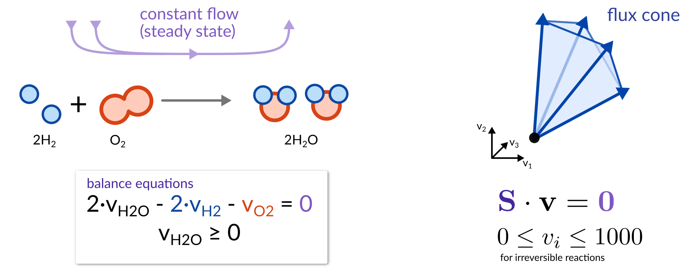

Note:

Let's take a look at how FBA works and how we can use that to infer these fluxes. FBA is a powerful computational tool, that allows us to infer fluxes through reactions in a system by reducing the possible solution space of fluxes to a biologically relevant one. FBA makes the critical assumption that the system being modeled, in this case the metabolism of a microbe, is in a state of constant flow, or steady state. This just means that the inflow and outflow of reactions in the systems are equal. A good analogy to this is opening a window in your house: you'll have air flowing in, and air flowing out, but you won't suddnely have more flowing in than out, suddenly your house expands and pops like a balloon because more is coming in than going out. That doesn't happen. This steady state assumption mimicks this, and is applicable in several biological phenomena. If we look at our example reaction here, we have hydrogen and oxygen combining to form water. In steady state, we can say that stoichiometrically, the amount of hydrogen and oxygen consumed are equal to the amount of water produced. We can represent this mathematically with this first equation - reactants with negative coefficients and products with positive coeffients, balanced to zero. Repeating this for all the reactions in our system and factoring out the fluxes, we end up with a stoichiometric maxtrix designated "S" that represents all of the reactions, as well as an unknown vector of fluxes, designated "v", which we are solving for. To satisfy our assumption of constant flow, we set S dot v equal to zero, which sets up our system of equations. Additionally, we can put constraints on the individual reactions, seen here. For instance, we can set the lower bound of this flux to zero. This will force the production of water, thereby adding flux through the first equation. Solving our set of equations leaves us with a flux cone, the space in multidimensional flux space that includes all sets of fluxes satisfying our constraints. You might notice, however, that there are an infinite number of solutions in our flux cone that satisfy these constraints. So, whats next??
---

The goal of FBA is to *reduce* the flux space to a *biologically relevant* one.

Note:

Well, the goal of FBA is to reduce that flux space to one that is biologically relevant, that is it mimics the actual behavior of the system as well as possible. But how do we find an optimal solution, within the possible solution space?

---

## Genome-scale metabolic modeling

Note:

To find that solution, we can look at growth rates. We know that bacteria can only be present in the system if they can grow, otherwise they would be excreted and no longer exist in the system. In practice, this means we can say we want the solution in that flux cone that corresponds with maximum biomass, since this is the biological goal of a growing microbe. Biomass production can also be represented as a flux, since it is in essence a measure of mass conversion. What's neat about flux balance analysis is that we can add information from a number of sources in order to determine our optimal solution. As we've mentioned, we can use the reactions present in the system to build a stoichiometric matrix, mathematically representing the reactions taking place and how they interact with each other, for instance precursors from one reaction required in another. We can actually infer this whole stoichiometric maxtrix from the the genome of a microbe, by looking at gene abundances to determine what reactions are potentially taking place in the system. Also, as we've mentioned, we make the assumption the system is at steady state. In practice, this means the bacteria is in the exponential growth phase, as the growth rate is constant and biomass production is constant, so we include this assumption to arrive at a solution. Reversibility of reactions can be determined by thermodynamics, as many reactions can only occur in one direction. Finally, we can also add constraints to the import of metabolites going into a system, which we can leverage to represent the metabolites available to the system to grow. in practice, we can use this to model effects of different diets on the microbiome, adding relevance to the predictions being made by FBA.  Adding these constraints in and solving for our fluxes, we can find the region in the flux cone that represents maximum biomass, shown here in red.

---

## Selecting biologically relevant fluxes

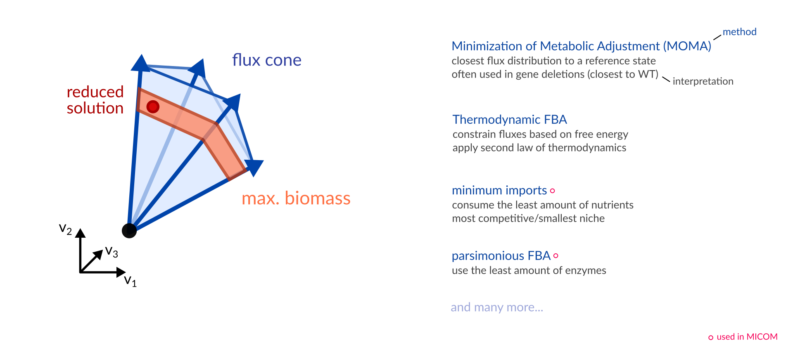

For instance, parsimonious FBA reproduces experimental fluxes in <i>E. coli</i> [very well](https://dx.doi.org/10.1038%2Fmsb.2010.47).

Note:

The art of FBA is to then find a single solution in that solution space that is the most biologically relevant. There are several methods available to find a single solution, but today we'll focus on these last two since these are leveraged by MICOM. One such method is minimizing the imports into a system - since the microbiome can be a highly competitive environment, this is biologically intuitive since the most successful residents in the microbiome would not need to rely on importing lots of metabolites to survive, rather subsisting on a smaller subset. Another common approach is parsimonious FBA, called pFBA, which basically minimizes the enzymes required to satisfy the constraints. Again, this is biologically intuitive, since bacteria are efficient beings and don't like to expend more energy than necessary on making enzymes. Really, the method you use is related to the question being asked and the system being modeled - is it competitve, is it resource limiting, etc. I encourage you to look more into these methods if you're interested in conducting FBA on your own. 

---

# MICOM

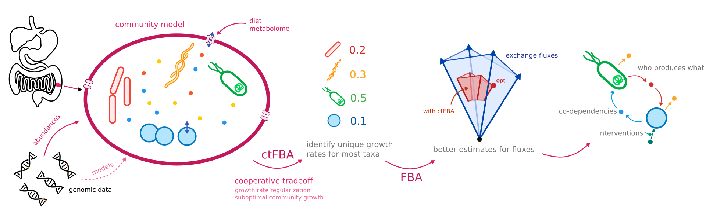

https://micom-dev.github.io/micom

Note:

To this point, we've focused on making genome scale metabolic models. To make metabolic models of the microbiome community, or metagenome scale metabolic models, we use a tool called MICOM, which extends flux balance analysis into microbial communities. To initially build the models, we need to pass in the relative abundance of bacteria in the sample. Due to sequencing efficiency differences, there may be some bias toward some bacteria over others, but the abundance from sequencing data should be more or less representative of the community. MICOM will then map this abundance data to a database containing hundreds genome-scale metabolic models of common gut microbes. MICOM then uses the reconstructions of those taxa present in the sample to build a massive stoichiometric matrix like the one we discussed earlier that includes not only the internal reactions within each taxon, but also the exchanges between them and external reactions, which in this case is the host. We can then specify particular diets that are representative of the food being eaten by the subject of the model. It will then use FBA with an additional regularization step to calculate unique growth rates for all the bacteria based on the process we've outlined previously, and then estimate all the fluxes in the system based on those growth rates, returning a most likely flux distribution. This give us a huge amount of output data, which we can then use to make detailed and interesting predictions about imports, exports, the inner machinations of bacterial reaction networks, co-dependcies between bacteria, and it provides a testing ground for potential interventions.

---

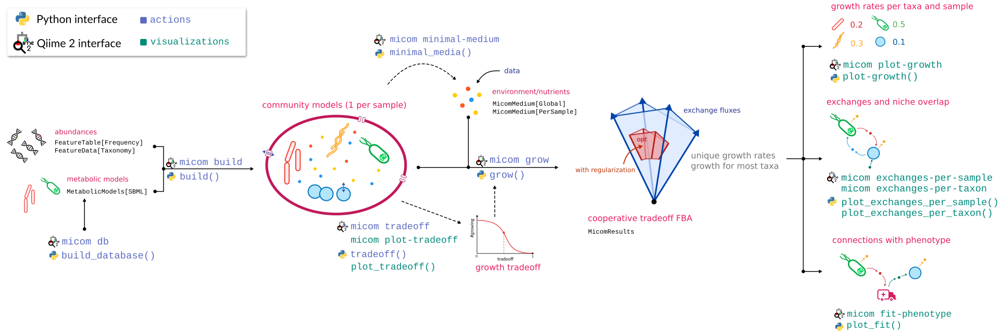

Note:

Here's the typical workflow for building metabolic models. First we build the models using abundance data and a database of genome scale metabolic models, then apply a medium representing available metabolites, and finally grow the models using a multi-step FBA method that'll we'll cover shortly. Whats neat about MICOM is that are two interfaces in which you can use it, both in python or in Qiime2. Today we'll be using the python interface, as that works in Colab, but you can preform any task with either of the interfaces, either actions like building or growing models or producing visualizations. It's also easy to switch between the two interfaces between steps, as MICOM can readily read Qiime artifacts and vice versa.

---

<!-- .slide: data-background="var(--primary)" class="dark" -->

## Let's continue with our data

:computer: Let's switch to the notebook...

---

<!-- .slide: data-background="var(--primary)" class="dark" -->

## Community-wide growth is hard :cry:

In a single genome-scale model we only have a single growth rate $\mu$. In a microbial community
we have several $\mu_i$ and a community growth rate

$$
\mu_c = \sum_i a_i\cdot\mu_i
$$

Why is this so hard? Can't we just maximize the community growth rate? Well...

Note: 

Great, so now we've covered classic flux balance analysis used for genome-scale metabolic models, and it seems pretty straightforward - maximize the growth rate, and get your answer. So can we just do the same in community models? Not quite. In genome scale models, we have a single growth rate, but in community models, we have multiple growth rates - one for each taxon, as well a community growth rate calculated by multiplying the relative abundance of each taxon by its growth rate and summing them all together. If we try to maximize the community growth rate, you'll find we quickly run into trouble. 

---

## When 2 leads to infinity...

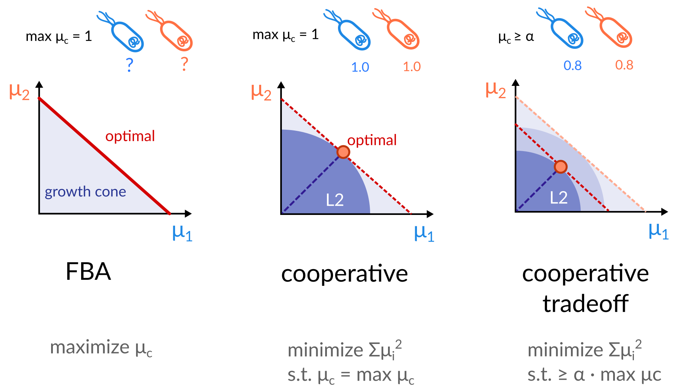

Note:

In practice, getting a community-wide growth rate using classic FBA doesn't work very well. Let's set up an example to illustrate, wherein we have two identical microbes in our community, lets say theyre both e coli, at the exact same abundances. If we know that the maximum community growth is 1, we see that there are actually an infinite number of solutions to this. We could have equal growth rates of 1 for each, which comes out to a community growth rate of 1, based on our definition in the last slide. Alternatively, we could have a growth rate of 2 for the orange one and zero for the blue one. This would still satisfy our maximum community growth rate of 1, despite the fact that 50% of the taxa aren't growing. There is actually an infinite number of solutions to this, represented by this red line in the first graph This isn't good, since this introduces a lot of ambiguity and increases the size of the flux cone to include non-biologically relevant solutions. So that's not what we want. Intuitively, we know that idenitcal strains should grow at the same growth rate. To overcome this, MICOM introduces a regularization technique that reduces the solution space back to a relevant one. If we make the assumption that we mentioned earlier, which is biologically intuitive, that any taxon present in a sample should be able to grow, the regularization strategy should return a solution in which most of the taxa are growing, omitting those terminal solutions in which some taxa aren't growing at all. What's called an L2 regularization scheme actually achieves this well, by minimizing the sum of the squares of the individual growth rates. This basically penalizes really high growth rates, and rather finds a solution along that maximal growth rate line that distributes the growth across as many taxa as possible. Indeed, we see that incorpoating this L2 strategy onto our example here, we end up with a solution in which both taxa are growing at the same rate, minimizing the L2 parameter and matching our intuition. Thinking biologically, though, it also makes sense that for every bacteria in a community to be able to grow, optimal growth rate might not be acheieved. An idealistic maximal growth rate might only occur when some bacteria are growing at the expense of others, and the biologically relevant growth rate may be suboptimal, falling below this maximal growth rate. In MICOM, we can model this by incorporating cooperative tradeoff wherein we define the fraction of the maximal community growth rate for which we want to conduct the L2 regularization. In this example we can set a tradeoff of 80% optimal growth, and we see slightly lower growth rates. Methods for choosing a tradeoff parameter is covered at the end of the course notebook, if you are interested. 

---

*Cooperative Tradeoff FBA* allows us to treat metagenome-scale models with the *same*
methods as genome-scale metabolic models (pFBA, minimal media, etc).

---

## But does it work?

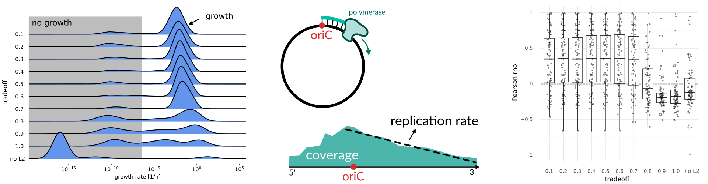

https://doi.org/10.1128/mSystems.00606-19

Note:

The age-old question. Here, we can results from a sample micom community, with the number of taxa growing at various tradeoff values. For reference, any growthrate below 10^-6 is effectively no growth. If we take no regularization step (no L2 parameter minimization), there is a super small number of taxa growing at high growth rate, and nearly all the taxa effectively not growing at all. Obviously, this is not what's actually happening in the microbiome, and this solution is not relevant to the system. If we apply the L2 regularization strategy at the maximal community growth rate, we see that a lot more taxa are able to grow - thats the L2 reguluarization distributing growth across as many taxa as possible. Like I mentioned, though, this maximal growth rate might not be achievable with all taxa growing. Lowering the tradeoff value just a little to 0.7, we see that almost all the taxa are able to grow, echoing what we expect to see in the microbial community. This result by itself statisfies our assumption that taxa present in the sample should be able to grow. The team also validated predicted growth rates by comparing them with actual growth rates. For these data, the team had metagenomes. Its been shown by the Segal lab that coverage profiles of metagenomic reads for fast growing bacteria can be used to estimate the growth rate. You can do this by measuring the decay in read coverage from the origin of replication. Using this method, the team could measure growth rates in vitro, and compare these to growth rates predicted by MICOM. You can see in this panel on the right that without regularization, or at high tradeoff values with regularization, the predicted growth rate did not correlate with calculated growth rate. Lowering the tradeoff value slightly showed a much stronger correlation with calculated growth rate, serving to validate this method. So, in short, cooperative tradeoff with L2 regularization helps us reach a solution wherein most taxa are able to grow, and the growth rates look a lot more like they do in real life. 

---

Easy peasy. What's taking so long then?

 

Well, metagenome-scale models are slightly larger... :sweat:

Note:

Awesome, these methods seem great and the math all checks out. So why is it taking so long to run these workflows? Well, typical MICOM models are a bit more complex than the examples I've been using to illustrate the methods, like our two e coli community. 

---

Note:

This is a visualization of a standard metagenome-scale metabolic model. Each pink dot represents a metabolite, and each blue dot a reaction, with black lines connecting them. Each of these regions is a single taxon in the community. You can see that the community model contains nearly 70k reactions, over 45k metabolites, and nearly 300k connections. So you can imagine that finding the optimal flux solution in this model takes some computational power, and sometimes a little patience! 

---

<!-- .slide: data-background="var(--primary)" class="dark" -->

## Let's return to the models we've built

:computer: Let's switch to the notebook!

---
<!-- .slide: data-background="var(--primary)" class="dark" -->

## Modeling the microbiome of underrepresented groups

Note: 

For this next part of the course, we'll revisit the theme of this years course: moeling the microbiome of historically underrepresented groups in microbiome research.  

---

## Underrepresented Groups

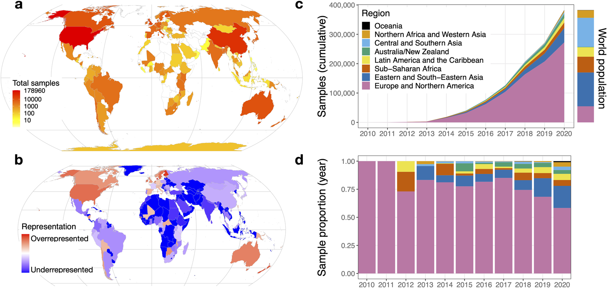

RJ Abdill et al., https://doi.org/10.1371/journal.pbio.3001536

Note:

 This visual, which Chris showed yesterday, shows us just how overrepresented North American and European microbiomes have been in the field of microbiome research in the past decade. Today, we will build metabolic models of the microbiome of the three indigenous groups introduced in yesterday's lesson, and use these models to make predictions of the metabolic behavior of each  based on the environmental context the microbiome is exposed to. We'll also see what work still needs to be done to make microbiome research more inclusive of these historically underrepresented groups, and how current methods can be shaped by overrepresentation of subsets of the population, such as European and North American microbiomes. 

---

## Environmental Context

How does the environment affect the microbiome?

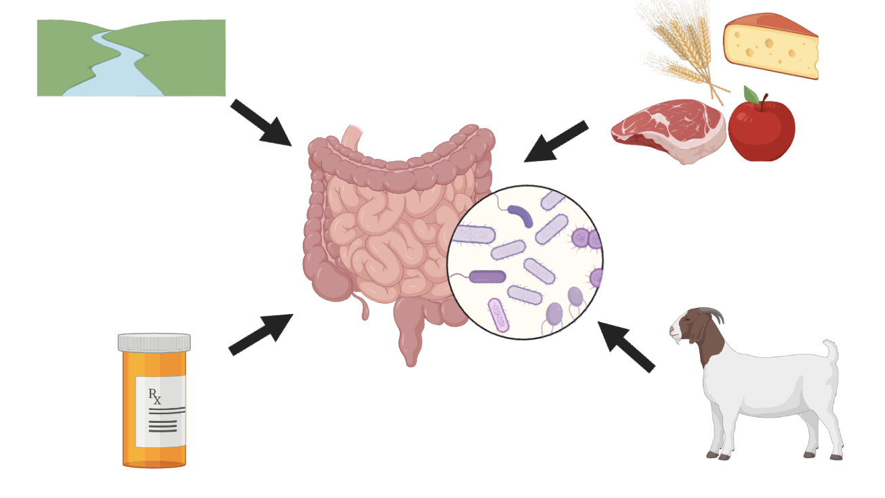

Note:

So what do I mean when I say environmental context? The environmental context to which the microbiome is exposed to is a key determinant of composition and subsequent metabolic response. This can take multiple forms - for instance, different water sources can impact the composition of the microbiome, drug use like taking antibiotics can cause large shifts in composition and subsequent metabolic behavior, exposure to pets and other animals can introduce different taxa to the microbiome, and finally diet is one of the most important contributors to the composition and metabolic behavior of the microbiome. In MICOM, we can partially represent the environmental context through an _in silico_ medium, that represents diet available to the microbiome. Since the metabolites in the diet are direct precursors of microbially produced metabolites, it is critical that the medium we use for the growth simulation in MICOM is representative of the diet typically consumed by the subject being modeled. Today, we'll investigate this by using two separate media for our samples - one, a matched medium, representing the diet of the indigenous groups we are modeling, and second, an unmatched medium, representing an average Austrian diet, not typically consumed by the individuals in these three indigenous groups. 

---

## Medium Construction

Media must be *componentized* (broken down into constitutent metabolites) to be used in MICOM

Many diets common in North America and Europe have been developed

Componetized dietary reconstructions of underrepreseted groups are not easily available

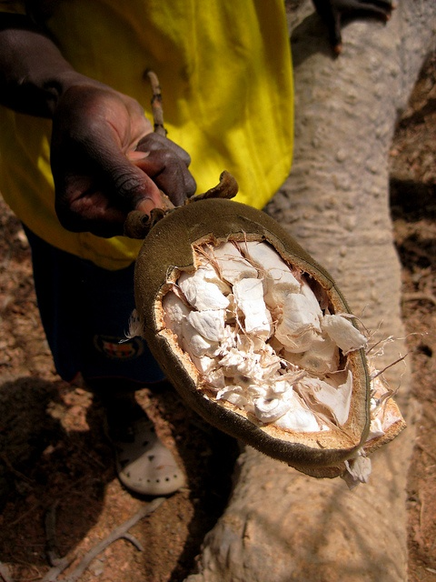

Note:

To use a medium for a growth simulation in MICOM, the medium must be componetized, that is, described by its constituent metabolic components. We can't yet just say, this person ate a banana. We rather have to determine what metabolites are in a banana, and add that. Componetizing media is a laborious task, as it requires determining the consitutents of various food components present in a diet, and adding them in the proper amounts. For diets of highly represented groups in microbiome research, such as North American or European diets, componetized media are publically available. However, media representative of the diet of underrepresented groups are not yet commonly available, and thus need to be constructed. This is additionally difficult, as databases used to map foods to their constituent metabolites consist primarily of foods common in North American and European diets. For instance, baobab fruit is a common component in the Hadza diet, but it is not found in commmonly used food databases. Construction of media representing the diet of underrepresented groups, as well the inclusion of food consumed by these groups in food databases is an issue that must be addressed by the microbiome research community in coming years in order to make research in this field more representative of the world population, rather than just groups that are historically overrepresented. 

---

## What's in the media?
- [Hadza in Tanzania](https://anthropology.ucsd.edu/_files/schoeninger-publications/Murray%20etal.2001.pdf) -   
  Baobab fruit & seeds, honey, antelope
- [Chepang in Nepal](https://www.ncbi.nlm.nih.gov/pmc/articles/PMC6237292/) -  
  Nettles, mountain yam, cowpea
- [Me'Phaa in Mexico](https://www.researchgate.net/publication/309681903_Restauracion_productiva_en_la_practica_el_caso_de_las_comunidades_indigenas_Me_Phaa_de_La_Montana_de_Guerrero_Mexico/) -  
  Corn, beans, chayote, chicken
  
Note: 

For this portion of the course, we aimed to construct three media, each containing the metabolic components of a representative meal for the Hadza, Chepang, or Me'Phaa communities, each of which were very distinct. First, we had to determine what that meal looked like, based on extensive literature review. For the Hadza community in Tanzania, a representative meal included baobab fruit and seeds, honey, and antelope. For the Chepang community in Nepal, we included nettles, mountain yam, and cowpea. Finally, a representative meal for the Me'Phaa community in Mexico, corn, beans, chayote, and chicken were included in the meal. Each of these is representative of a meal in each of these communities, but is not an exhaustive representation of their entire diet, which would require more extensive investigation. Additionally, seasonal dietary variations introduce shifts in metabolic availability to the microbiome that is not represented here. However, each of these diets is a much closer match to the corresponding community upon whose diet it was based than existing componetized media, and the metabolic components in each were quite distinct from the unmatched, representative Austrian diet. 

---

## Medium Construction

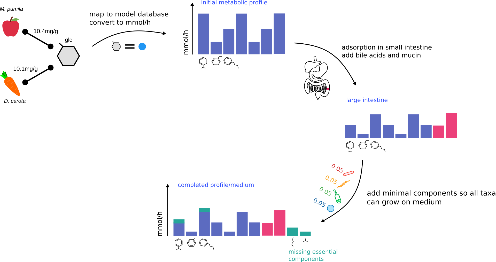

Note:

To construct the matched media we will use for modeling the growth of the microbiome for these indigenous communities, we first had to determine the dietary components present in the standard diet of each community, as I explained in the last slide. Next, we mapped each food to its constituent components using a food database. Like we mentioned previously, some foods like baobab fruit were not available on these databases. In these instances, more literature review was required to determine the composition. For instance, in the case of baobab fruit, we found an NMR-based study detailing it's metabolic composition. We then added the constitutent components to our medium at the correct relative abundances, mimicking the matched diet. Following this, we had to account for adsorption in the small intestine, where many metabolites from the diet are absorbed before they reach the large intestine, as well as adding bile acids and mucin. Finally, the medium undergoes a gap-filling process, that augments the medium with a minimal set of metabolites required so that all the taxa in the sample are capable of growing. Now, we have a componetized medium we can use to grow our samples, using the cooperative tradeoff FBA process I explained earlier. 

---
<!-- .slide: data-background="var(--primary)" class="dark" -->

## Before we look at our results...

Note:

I know at this point you must be so excited to see the results of the MICOM growth simulation, and your wait is almost over, but first lets take a look at some of the visualizations we'll create with the output from our results. Since MICOM gives us so much great data, it can be a little overwhelming at first, but don't worry. It's actually very easy to make great visualizations in MICOM, or extract the data to use in your favorite visualization package. 

---

## Growth Rates

Visualize growth rates of individual taxa per sample

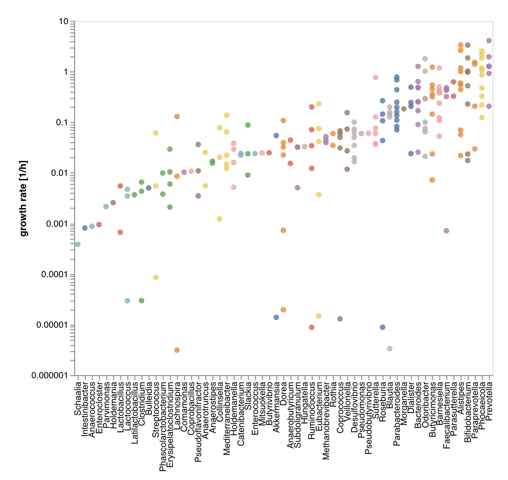

Note: 

First and foremost, we'll take a look at growth rates of the indivual taxa in each of our models. MICOM has a built in function for this, so it will be very easy to build. Here we have a scatter plot with log scaled growth rate on the y axis, for each taxa on the x axis. This plot is a great way to check that your models are growing correctly at a typical growth rate, like what we see here. It can also tell you which microbes are doing well and have high growth rates in the dietary context you have used to simulate the models. For instance, here we see that prevotella has a high growth rate, and seems to be thriving. We'll see in our results that the growth rates for individual taxa differ quite a bit, since the dietary context has changed. This echoes one of our primary points, which is that the diet is a major factor in the metabolic activity of the microbiome, and it is important to choose a representative diet. 

---

## The niche space

The context-dependent way in which a microbial taxon uses its environment

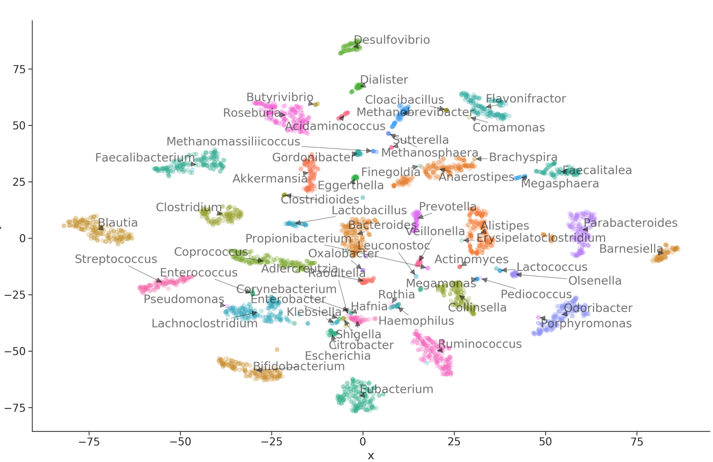

Note:

Next, we'll look at a visualization of the niche space of each taxon in each sample. The niche space represents the context-dependent way in which a taxon uses it's environment - in this case, how it uses the metabolites available to it. Since plotting all the metabolic exchanges wouldn't be possible, we'll use tSNE to make the plot. This technique takes high dimensional data and reduces it to two dimensions, such that similar points are closer together and less similar points are spaced farther apart. This gives us an idea of the metabolic niche each taxon falls into, and how similar or different it is from the other taxa in the community. Like I mentioned, niche space is context dependent. Some taxa change their metabolic behavior depending on what metabolites are present in their environment, allowing them to survive in multiple niche spaces. This adaptation can be helpful for their survival. We will see when comparing the relative positions of taxa between the matched and unmatched dietary contexts, many will change their predicted metabolic behavior and occupy a different niche space, underscoring the need for accurate diets to obtain accurate predictions. 

---

## Comparative metabolomics

Metabolomic exchanges are highly dependent on dietary context

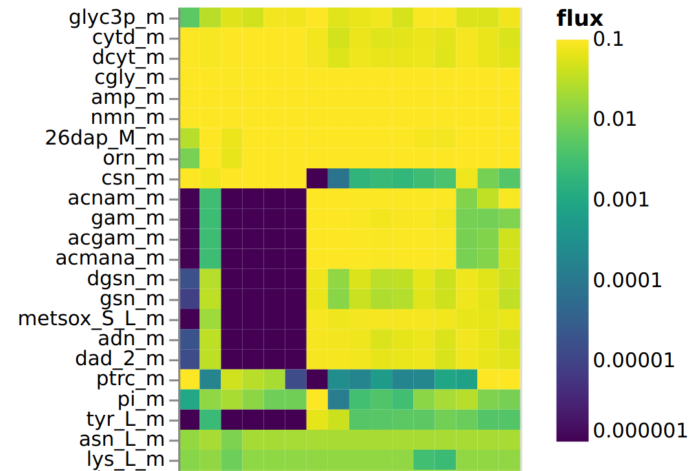

Note:

Finally, we'll take a look at the metabolic exports predicted from the growth of each metabolic model. As shown here, we'll construct a heatmap illustrating the amount of different metabolites produced and exported from taxa in each sample. In this case, each row represents a metabolite, and each column represents one of our samples, with cells colored in a logarithmic color map. While MICOM does have a built in tool to build heatmaps like the one shown here, we'll use this opportunity to take our output and build a visualization in another package, in this case we will use Seaborn. This will additionally allow us to plot the results of growth on both diets on a single plot. Similar to the niche space, the metabolic activity of any taxon in a community, and therefore its exchanges, is dependent on the context in which it grows - in this case, we'll look at exports from the microbiome between both the matched and unmatched diets we've used for modeling. Since the environmental context in these two growth simulations is so disparate, we expect to see very different exchange fluxes between each of the two media. Again, since we are interested in determining the most biologically relevant set of growth rates and fluxes, correct matching of diet with sample is crucial. 

---

## Your turn

Check out how to use MICOM for analysis of a single microbial community.

Note: 

Finally, once we're done looking at our output, it'll be your turn to jump in the drivers seat and explore using MICOM on your own. You can use the cells at the end of the notebook to explore loading a single model, applying a medium, and simulating growth. 

---

<!-- .slide: data-background="var(--primary)" class="dark" -->

## Let's check out our results and build some visualizations

:computer: Let's switch to the notebook!

---
<!-- .slide: data-background="assets/isb/microbes-azure.jpg" class="dark" -->

### And we are done :clap:

Christian Diener  
Nick Bohmann  
Sean Gibbons  
Sue Ishaq  
Emily Wissel  
Alex Carr  
Noa Rappaport  
Samantha Piekos  
James Johnson  
Kathryn Stephenson

Dominic Lewis  
Allison Kudla  
Audri Hubbard  
Joe Myxter  
Thea Swanson  
Victoria Uhl 
Connor Kelly 
Shanna Braga 
ISB Facilities Team

 

# Thanks! :heart:
