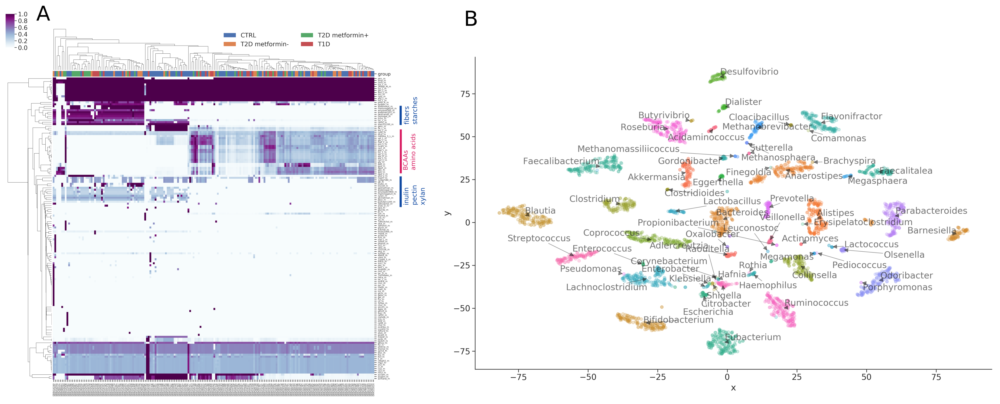

<!-- .slide: data-background="assets/isb/data-midnight.jpg" class="dark" -->

# Predicting personalized microbiome-mediated responses

### Nick Bohmann, Gibbons Lab

from the *ISB Microbiome Course 2022*

 

<a href="https://creativecommons.org/licenses/by-sa/4.0/"><i class="fa fa-bullhorn"></i>CC-BY-SA</a>
<a href="https://gibbons.isbscience.org/"><i class="fa fa-globe"></i>gibbons.isbscience.org</a>
<a href="https://github.com/gibbons-lab"><i class="fa fa-github"></i>gibbons-lab</a>
<a href="https://twitter.com/thaasophobia"><i class="fa fa-twitter"></i>@BioBohmann</a>

---

<!-- .slide: data-background="var(--primary)" class="dark" -->

Let's get the slides first (use your computer, phone, TV, fridge)

*https://gibbons-lab.github.io/isb_course_2022/micom*
---

<!-- .slide: data-background="var(--primary)" class="dark" -->

## Quick reminder :clock:

 

---

# Functional analyses

Tries to predict what the microbiome *does* from sequencing data.

Uses gene/transcript/protein/metabolite abundances (metagenomics, metatranscriptomics, proteomics or metabolomics).

Gene content yields metabolic *capacity* or *potential*.

Note: 

Today we'll look at functional analyses of the gut microbiome. That is, not just what's there, but what it does. You can somewhat use gene and metabolite abundances to get to this, but not entirely, as these measures rather give you insight into the potential of the community. 

---

<!-- .slide: data-background="var(--secondary)" class="dark" -->

# Genes and metabolite abundances are cool but not what you really care about*

hot take :fire:

Note: 

Here's the thing: what we really care about in the lens of functional analysis is actually metabolic flux. This will tell us more about the behavior of the microbiome than any abundances.  

---

## Fluxes

<video width="45%" autoplay loop>
  <source src="assets/fluxes.mp4" type="video/mp4">
</video>

video courtesy of [S. Nayyak](https://twitter.com/Na_y_ak) and [J. Iwasa](https://twitter.com/janetiwasa)

Note: 
Fluxes are measures of metabolic transport, into the system and through internal reactions. They can be very informative, since they tell you which pathways are the most active in a system, and what subsequent pathways are initiated. The visual here shows us why fluxes are more informative than abundances for metabolites: in this case, we have a high import flux for glucose, but the glucose very quickly is converted to pyruvate, so if we measure interal glucose levels, they might be super low. This doesn't tell the whole story, though, since glucose is obviously very important. The problem with measuring fluxes, however, is that it is laborious and quite costly. Longitudinal metabolomics can work, but takes time, effort and expense. Isotopic labeling is another option, but that can be even more costly. So what we need is a way to estimate fluxes, without the experimental expense. 

---

<!-- .slide: data-background="var(--secondary)" class="dark" -->

# Flux Balance Analysis (FBA)

Can we infer the most likely fluxes in a biological system?

Note: 

To do just that, we can use a method called flux balance analysis. This is a computational method that infers the most likely fluxes in a biological system. 

---

## The flux cone

---

The goal of FBA is to *reduce* the flux space to a *biologically relevant* one.

---

## Genome-scale metabolic modeling

---

## Selecting biologically relevant fluxes via parsimony

Reproduces experimental fluxes in <i>E. coli</i> [very well](https://dx.doi.org/10.1038%2Fmsb.2010.47).

Bacteria do not like to produce more enzymes than necessary.

Note: 

---

# MICOM

https://micom-dev.github.io/micom

---

---

<!-- .slide: data-background="var(--primary)" class="dark" -->

## Let's continue with our data

:computer: Let's switch to the notebook...

---

<!-- .slide: data-background="var(--primary)" class="dark" -->

## Community-wide growth is hard :cry:

In a single genome-scale model we only have a single growth rate $\mu$. In a microbial community
we have several $\mu_i$ and a community growth rate

$$
\mu_c = \sum_i a_i\cdot\mu_i
$$

Why is this so hard? Can't we just maximize the community growth rate? Well...

---

## When 2 leads to infinity...

---

*Cooperative Tradeoff FBA* allows us to treat metagenome-scale models with the *same*
methods as genome-scale metabolic models (pFBA, minimal media, etc).

---

## But does it work?

https://doi.org/10.1128/mSystems.00606-19

---

Easy peasy. What's taking so long then?

 

Well, metagenome-scale models are slightly larger... :sweat:

---

69,441 reactions / 46,883 metabolites / 292,699 connections

---
<!-- .slide: data-background="var(--primary)" class="dark" -->

## Modeling the microbiome of underrepresented groups
---
## Underrepresented Groups 

https://doi.org/10.1371/journal.pbio.3001536

Note:

Let's take a look again at the them of this year's symposium - studying the gut microbiome of underrepresented groups in microbiome research. This visual, shown yesterday, shows us just how overrepresented North American and European microbiomes are in the field of microbiome research. Today, we will build models of the microbiome of the three indigenous groups introduced in yesterday's lesson, and use these models to make predictions of the metabolic behavior of each microbiome. 

---
## Environmental Context
So, what *insights* can we gain from constructing these models?

Note: 

The *environmental context* to which the microbiome is exposed to is a key determinant of composition and subsequent metabolomic respons
In MICOM, we can partially represent the environmental context through an _in silico_ medium

---
## Medium Construction
Media must be *componentized* (broken down into constitutent metabolites) to be used in MICOM

Many diets common in North America and Europe have been developed (average Western, vegan etc.)

Componetized dietary reconstructions of underrepreseted groups are not easily available

Note: 

To use a medium for a growth simulation in MICOM, the medium must be componetized, that is, described by its constituent metabolic components. This is a laborious task, as it requires determining the consitutents of various food components present in a diet, and adding them in the proper amounts. For diets of highly represented groups in microbiome research, such as North American or European diets, componetized media are publically available. However, it is difficult to find pre-constructed componetized media representative of the diet of underrepresented groups, like the three indigenous populations for whom we are building metabolic models today. 

---
## Medium Construction
To construct a medium: 
1. Determine dietary components
2. Map dietary components to constituent metabolites
3. Balance constituent metabolites in media at relative abundance
4. Gap-fill to allow growth 
---
<!-- .slide: data-background="var(--primary)" class="dark" -->

## Let's Peek at Our Results!
---

## The niche space
The context-dependent way in which a microbial taxon uses its environment

---
## Comparative metabolomics 

Metabolomic exchanges are highly dependent on dietary context 

---

## Your turn

Check out how to use MICOM for a "n-of-1" analysis.

---

<!-- .slide: data-background="var(--primary)" class="dark" -->

### And we are done :clap:

# Thanks!
