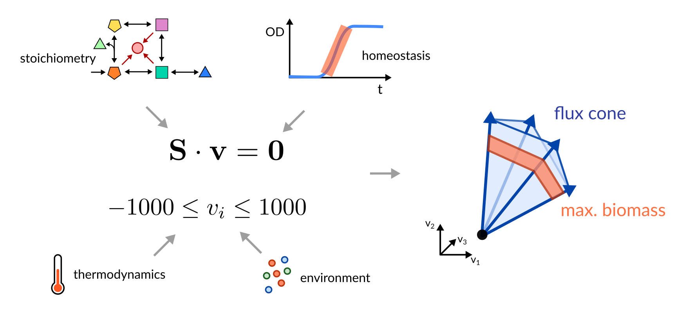
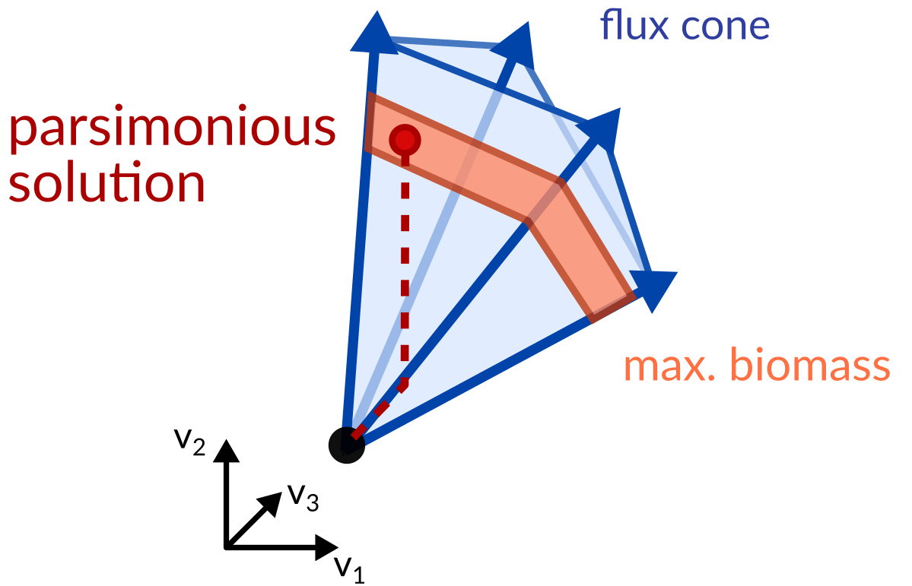
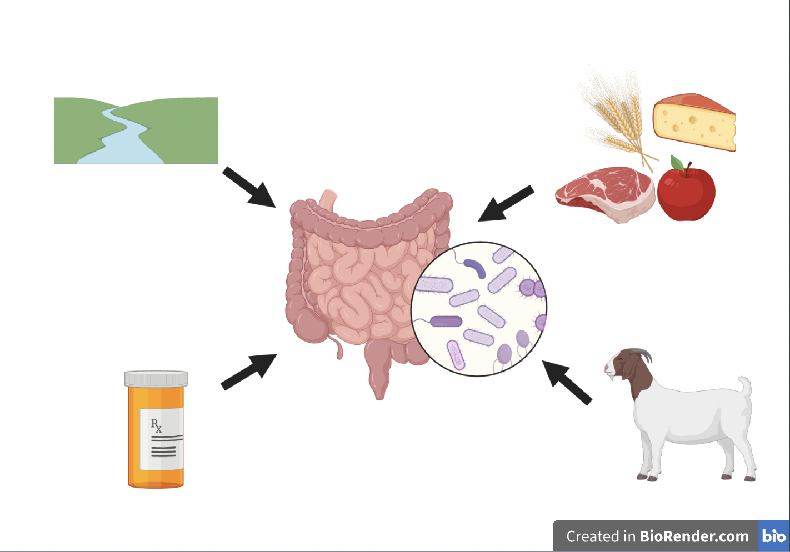
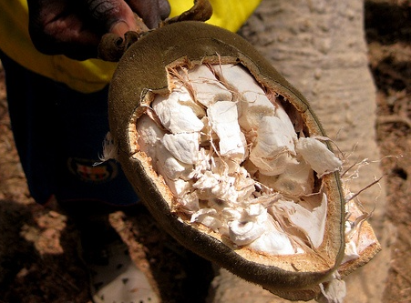

<!-- .slide: data-background="assets/isb/data-midnight.jpg" class="dark" -->

# Predicting personalized microbiome-mediated responses

### Nick Bohmann, Gibbons Lab

>>>>>>> 7d36f28d57b0cd3966a3bbb2732052581e88f8af

from the *ISB Microbiome Course 2022*

 

<a href="https://creativecommons.org/licenses/by-sa/4.0/"><i class="fa fa-bullhorn"></i>CC-BY-SA</a>
<a href="https://gibbons.isbscience.org/"><i class="fa fa-globe"></i>gibbons.isbscience.org</a>
<a href="https://github.com/gibbons-lab"><i class="fa fa-github"></i>gibbons-lab</a>
<a href="https://twitter.com/thaasophobia"><i class="fa fa-twitter"></i>@BioBohmann</a>

---

<!-- .slide: data-background="var(--primary)" class="dark" -->

Let's get the slides first (use your computer, phone, TV, fridge)

*https://gibbons-lab.github.io/isb_course_2022/micom*
---

<!-- .slide: data-background="var(--primary)" class="dark" -->

## Quick reminder :clock:

 

---

# Functional analyses

Tries to predict what the microbiome *does* from sequencing data.

Uses gene/transcript/protein/metabolite abundances (metagenomics, metatranscriptomics, proteomics or metabolomics).

Gene content yields metabolic *capacity* or *potential*.

---

<!-- .slide: data-background="var(--secondary)" class="dark" -->

# Genes and metabolite abundances are cool but not what you really care about*

hot take :fire:

---

## Fluxes

<video width="45%" autoplay loop>
  <source src="assets/fluxes.mp4" type="video/mp4">
</video>

video courtesy of [S. Nayyak](https://twitter.com/Na_y_ak) and [J. Iwasa](https://twitter.com/janetiwasa)

---

<!-- .slide: data-background="var(--secondary)" class="dark" -->

# Flux Balance Analysis (FBA)

Can we infer the most likely fluxes in a biological system?

---

## The flux cone

---

The goal of FBA is to *reduce* the flux space to a *biologically relevant* one.

---

## Genome-scale metabolic modeling

---

## Selecting biologically relevant fluxes via parsimony

Reproduces experimental fluxes in <i>E. coli</i> [very well](https://dx.doi.org/10.1038%2Fmsb.2010.47).

Bacteria do not like to produce more enzymes than necessary.

---

# MICOM

https://micom-dev.github.io/micom

---

---

<!-- .slide: data-background="var(--primary)" class="dark" -->

## Let's continue with our data

:computer: Let's switch to the notebook...

---

<!-- .slide: data-background="var(--primary)" class="dark" -->

## Community-wide growth is hard :cry:

In a single genome-scale model we only have a single growth rate $\mu$. In a microbial community
we have several $\mu_i$ and a community growth rate

$$
\mu_c = \sum_i a_i\cdot\mu_i
$$

Why is this so hard? Can't we just maximize the community growth rate? Well...

---

## When 2 leads to infinity...

---

*Cooperative Tradeoff FBA* allows us to treat metagenome-scale models with the *same*
methods as genome-scale metabolic models (pFBA, minimal media, etc).

---

## But does it work?

https://doi.org/10.1128/mSystems.00606-19

---

Easy peasy. What's taking so long then?

 

Well, metagenome-scale models are slightly larger... :sweat:

---

69,441 reactions / 46,883 metabolites / 292,699 connections

---
<!-- .slide: data-background="var(--primary)" class="dark" -->

## Modeling the microbiome of underrepresented groups
---
## Underrepresented Groups 

https://doi.org/10.1371/journal.pbio.3001536

---
## Environmental Context
So, what *insights* can we gain from constructing these models?

The *environmental context* to which the microbiome is exposed to is a key determinant of composition and subsequent metabolomic response

In MICOM, we can partially represent the environmental context through an _in silico_ medium

---
## Medium Construction
Media must be *componentized* (broken down into constitutent metabolites) to be used in MICOM

Many diets common in North America and Europe have been developed (average Western, vegan etc.)

Componetized dietary reconstructions of underrepreseted groups are not easily available

---
## Medium Construction
To construct a medium: 
1. Determine dietary components
2. Map dietary components to constituent metabolites
3. Balance constituent metabolites in media at relative abundance
4. Gap-fill to allow growth 
---
<!-- .slide: data-background="var(--primary)" class="dark" -->

## What to look for in results
---

## The niche space
The context-dependent way in which a microbial taxon uses its environment

---
## Comparative metabolomics 

Metabolomic exchanges are highly dependent on dietary context 

---

## Your turn

Check out how to use MICOM for a "n-of-1" analysis.

---

<!-- .slide: data-background="var(--primary)" class="dark" -->

### And we are done :clap:

# Thanks!
